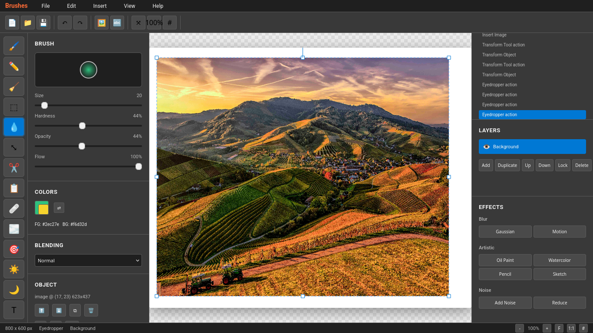

# Brushes

[](https://github.com/ilovelasagne/brushes/stargazers)
[](https://opensource.org/licenses/MIT)
[](https://ilovelasagne.github.io/brushes/)

Brushes is a powerful, web-based image editor designed to provide a simple yet feature-rich experience for editing images directly in your browser. It's completely free, open source, and requires no installation or sign-up.



## ✨ Features

### 🎨 Advanced Drawing Tools
- **Brush Tool**: Customizable brushes with size, hardness, opacity, and flow controls
- **Pencil Tool**: Hard-edged strokes for precise work
- **Eraser Tool**: Remove pixels with adjustable settings
- **Eyedropper**: Pick colors from your canvas
- **Clone Stamp**: Copy and paint areas of your image
- **Healing Brush**: Smart healing with source selection

### 🖼️ Image Manipulation
- **Transform Tool**: Move, rotate, resize, and flip objects
- **Crop Tool**: Trim your canvas to the perfect size
- **Selection Tool**: Rectangular selections for precise editing
- **Text Tool**: Add and edit text with custom fonts, sizes, and colors

### 🎭 Effects & Filters
- **Blur & Sharpen**: Localized adjustments
- **Dodge & Burn**: Lighten or darken areas
- **Artistic Filters**: Oil painting, watercolor, pencil sketch, and more
- **Noise Reduction**: Clean up grainy images

### 📑 Professional Workflow
- **Layer Management**: Non-destructive editing with layers, blend modes, and opacity
- **History & Undo/Redo**: Full history tracking with unlimited undo
- **Multiple Projects**: Tabbed interface for working on multiple images
- **Templates**: Pre-built templates for social media (Instagram, YouTube, Twitter, etc.)

### 🚀 Performance
- **WASM Acceleration**: Hardware-accelerated brush strokes and filters
- **Real-time Preview**: Instant feedback as you edit
- **Auto-save**: Automatic draft saving to prevent data loss

## 🚀 Quick Start

1. **Open the Editor**: Visit [Brushes](https://ilovelasagne.github.io/brushes-web/) and click "Launch Editor"
2. **Create New Project**: Choose from templates or start with a custom size
3. **Import Images**: Use "Insert Image" to add photos to your canvas
4. **Edit & Enhance**: Use the toolbox to draw, paint, and apply effects
5. **Export**: Save your work as PNG with the "Save" button

## 📖 Documentation

Comprehensive documentation is available at [docs.html](https://ilovelasagne.github.io/brushes-web/docs.html), including:
- Detailed tool guides
- Keyboard shortcuts
- FAQ and troubleshooting
- API references for developers

## 🛠️ Tech Stack

- **Frontend**: HTML5, CSS3, JavaScript (ES6+)
- **Canvas API**: High-performance 2D graphics rendering
- **WebAssembly (WASM)**: Accelerated image processing
- **Storage**: Browser localStorage and cookies for drafts
- **UI Framework**: Custom CSS with Tailwind CSS
- **Fonts**: Google Fonts (Inter, Montserrat, Roboto)

## 🔧 System Requirements

- Modern web browser with HTML5 Canvas support
- JavaScript enabled
- For best performance: WebAssembly support (most modern browsers)

## 📱 Browser Support

- Chrome 82+
- Firefox 75+
- Safari 13+
- Edge 80+

## 🤝 Contributing

We welcome contributions! Here's how you can help:

1. **Fork** the repository
2. **Create** a feature branch (`git checkout -b feature/amazing-feature`)
3. **Commit** your changes (`git commit -m 'Add amazing feature'`)
4. **Push** to the branch (`git push origin feature/amazing-feature`)
5. **Open** a Pull Request

### Development Setup

```bash
# Clone the repository
git clone https://github.com/ilovelasagne/brushes.git
cd brushes

# Open in browser (no build required)
# Simply open index.html or type2.html in your browser
```

### Code Structure

- `index.html` - Landing page and marketing site
- `type2.html` - Main editor application
- `docs.html` - Documentation and help
- `privacy.html` - EULA and privacy policy
- `brushes/` - Directory for additional assets (currently empty)

## 📄 License

This project is licensed under the MIT License - see the [LICENSE](LICENSE) file for details.

## 🔒 Privacy & Security

- **No Data Collection**: We don't store your images or personal data on servers
- **Local Processing**: All editing happens in your browser
- **Cookie Usage**: Optional cookies for draft saving (with explicit consent)
- **Open Source**: Transparent code you can audit

Read our full [Privacy Policy and EULA](privacy.html) for more information.

## 🙏 Acknowledgments

- Built with ❤️ by the open source community
- Inspired by professional desktop editors like Photoshop
- Uses WebAssembly for performance-critical operations

## 📞 Support

- **Documentation**: [docs.html](docs.html)
- **Issues**: [GitHub Issues](https://github.com/ilovelasagne/brushes/issues)
- **Discussions**: [GitHub Discussions](https://github.com/ilovelasagne/brushes/discussions)

---

**Enjoy creating with Brushes!** 🎨
